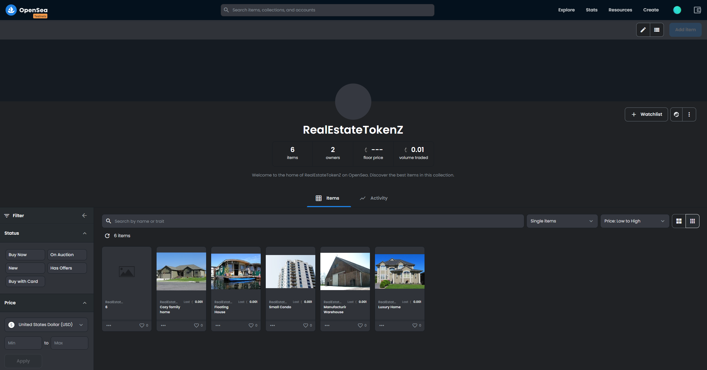
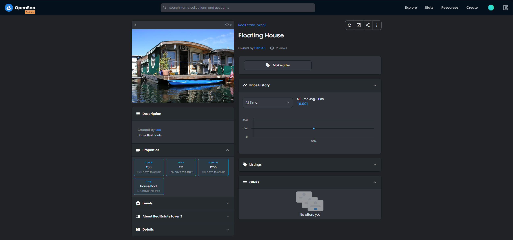

# Udacity Blockchain Capstone

This project is about managing Real Estate Marketplace in Etherium Blockchain. Each property is represented by ERC721 Token. before you can mint a token you need to verify that you are the owner of the property. zk-SNARKs is used to create a verification system which can prove you have title to the property without revealing that specific information on the property.Once the token has been verified you will place it on a blockchain market place (OpenSea) for others to purchase.

Versions
 - Truffle : v5.4.26
 - Node : v16.13.2
 - Web3.js : v1.5.3
 - zokrates/zokrates : 1.0.43
  

## Install

To install, download or clone the repo, then:
* `npm install`
  
To compile go  under `eth-contracts` folder then execute :
* `truffle compile`

## launch tests

To run truffle tests:
1. ` ganache-cli -l 10000000000`
2.  In another Terminal : 
    - `cd eth-contracts && truffle test --network development`


## Deployment on Rinkeby

```
Starting migrations...
======================
> Network name:    'rinkeby'
> Network id:      4
> Block gas limit: 29999972 (0x1c9c364)


1_initial_migration.js
======================

   Replacing 'Migrations'
   ----------------------
   > transaction hash:    0x3757ac417534832d9297932cd2256f08f28990cc94102d84ff2c30b9e3c1135d
   > Blocks: 1            Seconds: 14
   > contract address:    0xC632F1710667a84101a4c237A36173C04C3092b1
   > block number:        10668757
   > block timestamp:     1652443370
   > account:             0xD10DA32e7560Ef650dAbB392289C48bEA37AcD45
   > balance:             0.14205782
   > gas used:            274520 (0x43058)
   > gas price:           10 gwei
   > value sent:          0 ETH
   > total cost:          0.0027452 ETH


   > Saving migration to chain.
   > Saving artifacts
   -------------------------------------
   > Total cost:           0.0027452 ETH


2_deploy_contracts.js
=====================

   Deploying 'Verifier'
   --------------------
   > transaction hash:    0xd045604d8fbaa256b057980649d3673bd2cffb590278daadc52327f3856a8efe
   > Blocks: 2            Seconds: 22
   > contract address:    0x81050066f14230b25D615E4FADAd98e02A911604
   > block number:        10668760
   > block timestamp:     1652443415
   > account:             0xD10DA32e7560Ef650dAbB392289C48bEA37AcD45
   > balance:             0.12960792
   > gas used:            1199052 (0x124bcc)
   > gas price:           10 gwei
   > value sent:          0 ETH
   > total cost:          0.01199052 ETH


   Replacing 'SolnSquareVerifier'
   ------------------------------
   > transaction hash:    0x083c7a323de6ffc957fb065e134e2679ed4632908199d889f134ea939ddd11fe
   > Blocks: 1            Seconds: 6
   > contract address:    0x5A746a757dD183c648cfb7619307C3f46c5a55F6
   > block number:        10668761
   > block timestamp:     1652443430
   > account:             0xD10DA32e7560Ef650dAbB392289C48bEA37AcD45
   > balance:             0.09293595
   > gas used:            3667197 (0x37f4fd)
   > gas price:           10 gwei
   > value sent:          0 ETH
   > total cost:          0.03667197 ETH


   > Saving migration to chain.
   > Saving artifacts
   -------------------------------------
   > Total cost:          0.04866249 ETH
```

## Token Minting

A simple NodeJS script has been used to mint the 10 tokens. <br>
    `truffle exec scripts\mint.js --network rinkeby`

```
Using network 'rinkeby'.

Token minted, index: 1
        tx: 0x9ffaa98d509d5c1e69c8d8e3492a1c0ba9b5c4eabbc9b9e7278ff5e1e672a7ef
Token minted, index: 2
        tx: 0xa2c79ac2d03c0feb10e70ac47d6d9958c9f6a74352034831d9d503fd74b8fd2c
Token minted, index: 3
        tx: 0x4a08d7dcd32ec7e982e62c16193c729a04356eee87b63431c5e02c1ba1f288a0
Token minted, index: 4
        tx: 0xb41246c28321ee8450453bd632f9a1ac77b9abc2a50613ca9eeac485e9d20c9c
Token minted, index: 5
        tx: 0x88a3cf75e02eb1fa9b93a2e7feb51eefd4018408c4f1403bdc5003bca2309528
Token minted, index: 6
        tx: 0x65042dd1a5f55fafb6a47e5f2dfac66f6cb83d9dbf4558ea4fda7181818a3fc2
Tokens successfully minted
```

## Tokens Listed On Opensea

https://testnets.opensea.io/collection/realestatetokenz

> The NFTs have been traded between sample accounts and the activiy can be found in the screenshot below.

## Screenshots






## Contract ABI

```
[
    {
      "inputs": [
        {
          "internalType": "address",
          "name": "_verifierContractAddress",
          "type": "address"
        }
      ],
      "stateMutability": "nonpayable",
      "type": "constructor"
    },
    {
      "anonymous": false,
      "inputs": [
        {
          "indexed": true,
          "internalType": "address",
          "name": "owner",
          "type": "address"
        },
        {
          "indexed": true,
          "internalType": "address",
          "name": "approved",
          "type": "address"
        },
        {
          "indexed": true,
          "internalType": "uint256",
          "name": "tokenId",
          "type": "uint256"
        }
      ],
      "name": "Approval",
      "type": "event"
    },
    {
      "anonymous": false,
      "inputs": [
        {
          "indexed": true,
          "internalType": "address",
          "name": "owner",
          "type": "address"
        },
        {
          "indexed": true,
          "internalType": "address",
          "name": "operator",
          "type": "address"
        },
        {
          "indexed": false,
          "internalType": "bool",
          "name": "approved",
          "type": "bool"
        }
      ],
      "name": "ApprovalForAll",
      "type": "event"
    },
    {
      "anonymous": false,
      "inputs": [
        {
          "indexed": false,
          "internalType": "address",
          "name": "newOwner",
          "type": "address"
        }
      ],
      "name": "OwnerShipTransfer",
      "type": "event"
    },
    {
      "anonymous": false,
      "inputs": [
        {
          "indexed": false,
          "internalType": "address",
          "name": "triggerAddress",
          "type": "address"
        }
      ],
      "name": "Paused",
      "type": "event"
    },
    {
      "anonymous": false,
      "inputs": [
        {
          "indexed": false,
          "internalType": "bytes32",
          "name": "key",
          "type": "bytes32"
        },
        {
          "indexed": false,
          "internalType": "uint256",
          "name": "tokenId",
          "type": "uint256"
        },
        {
          "indexed": false,
          "internalType": "address",
          "name": "user",
          "type": "address"
        }
      ],
      "name": "SolutionAdded",
      "type": "event"
    },
    {
      "anonymous": false,
      "inputs": [
        {
          "indexed": true,
          "internalType": "address",
          "name": "from",
          "type": "address"
        },
        {
          "indexed": true,
          "internalType": "address",
          "name": "to",
          "type": "address"
        },
        {
          "indexed": true,
          "internalType": "uint256",
          "name": "tokenId",
          "type": "uint256"
        }
      ],
      "name": "Transfer",
      "type": "event"
    },
    {
      "anonymous": false,
      "inputs": [
        {
          "indexed": false,
          "internalType": "address",
          "name": "triggerAddress",
          "type": "address"
        }
      ],
      "name": "Unpaused",
      "type": "event"
    },
    {
      "inputs": [
        {
          "internalType": "bytes32",
          "name": "_myid",
          "type": "bytes32"
        },
        {
          "internalType": "string",
          "name": "_result",
          "type": "string"
        }
      ],
      "name": "__callback",
      "outputs": [],
      "stateMutability": "nonpayable",
      "type": "function"
    },
    {
      "inputs": [
        {
          "internalType": "bytes32",
          "name": "_myid",
          "type": "bytes32"
        },
        {
          "internalType": "string",
          "name": "_result",
          "type": "string"
        },
        {
          "internalType": "bytes",
          "name": "_proof",
          "type": "bytes"
        }
      ],
      "name": "__callback",
      "outputs": [],
      "stateMutability": "nonpayable",
      "type": "function"
    },
    {
      "inputs": [
        {
          "internalType": "address",
          "name": "to",
          "type": "address"
        },
        {
          "internalType": "uint256",
          "name": "tokenId",
          "type": "uint256"
        }
      ],
      "name": "approve",
      "outputs": [],
      "stateMutability": "nonpayable",
      "type": "function"
    },
    {
      "inputs": [
        {
          "internalType": "address",
          "name": "owner",
          "type": "address"
        }
      ],
      "name": "balanceOf",
      "outputs": [
        {
          "internalType": "uint256",
          "name": "",
          "type": "uint256"
        }
      ],
      "stateMutability": "view",
      "type": "function",
      "constant": true
    },
    {
      "inputs": [],
      "name": "baseTokenUri",
      "outputs": [
        {
          "internalType": "string",
          "name": "",
          "type": "string"
        }
      ],
      "stateMutability": "view",
      "type": "function",
      "constant": true
    },
    {
      "inputs": [
        {
          "internalType": "uint256",
          "name": "tokenId",
          "type": "uint256"
        }
      ],
      "name": "getApproved",
      "outputs": [
        {
          "internalType": "address",
          "name": "",
          "type": "address"
        }
      ],
      "stateMutability": "view",
      "type": "function",
      "constant": true
    },
    {
      "inputs": [],
      "name": "getOwner",
      "outputs": [
        {
          "internalType": "address",
          "name": "",
          "type": "address"
        }
      ],
      "stateMutability": "view",
      "type": "function",
      "constant": true
    },
    {
      "inputs": [
        {
          "internalType": "address",
          "name": "owner",
          "type": "address"
        },
        {
          "internalType": "address",
          "name": "operator",
          "type": "address"
        }
      ],
      "name": "isApprovedForAll",
      "outputs": [
        {
          "internalType": "bool",
          "name": "",
          "type": "bool"
        }
      ],
      "stateMutability": "view",
      "type": "function",
      "constant": true
    },
    {
      "inputs": [
        {
          "internalType": "address",
          "name": "to",
          "type": "address"
        },
        {
          "internalType": "uint256",
          "name": "tokenId",
          "type": "uint256"
        }
      ],
      "name": "mint",
      "outputs": [
        {
          "internalType": "bool",
          "name": "",
          "type": "bool"
        }
      ],
      "stateMutability": "nonpayable",
      "type": "function"
    },
    {
      "inputs": [],
      "name": "name",
      "outputs": [
        {
          "internalType": "string",
          "name": "",
          "type": "string"
        }
      ],
      "stateMutability": "view",
      "type": "function",
      "constant": true
    },
    {
      "inputs": [
        {
          "internalType": "uint256",
          "name": "tokenId",
          "type": "uint256"
        }
      ],
      "name": "ownerOf",
      "outputs": [
        {
          "internalType": "address",
          "name": "",
          "type": "address"
        }
      ],
      "stateMutability": "view",
      "type": "function",
      "constant": true
    },
    {
      "inputs": [
        {
          "internalType": "address",
          "name": "from",
          "type": "address"
        },
        {
          "internalType": "address",
          "name": "to",
          "type": "address"
        },
        {
          "internalType": "uint256",
          "name": "tokenId",
          "type": "uint256"
        }
      ],
      "name": "safeTransferFrom",
      "outputs": [],
      "stateMutability": "nonpayable",
      "type": "function"
    },
    {
      "inputs": [
        {
          "internalType": "address",
          "name": "from",
          "type": "address"
        },
        {
          "internalType": "address",
          "name": "to",
          "type": "address"
        },
        {
          "internalType": "uint256",
          "name": "tokenId",
          "type": "uint256"
        },
        {
          "internalType": "bytes",
          "name": "_data",
          "type": "bytes"
        }
      ],
      "name": "safeTransferFrom",
      "outputs": [],
      "stateMutability": "nonpayable",
      "type": "function"
    },
    {
      "inputs": [
        {
          "internalType": "address",
          "name": "to",
          "type": "address"
        },
        {
          "internalType": "bool",
          "name": "approved",
          "type": "bool"
        }
      ],
      "name": "setApprovalForAll",
      "outputs": [],
      "stateMutability": "nonpayable",
      "type": "function"
    },
    {
      "inputs": [
        {
          "internalType": "bool",
          "name": "state",
          "type": "bool"
        }
      ],
      "name": "setPaused",
      "outputs": [],
      "stateMutability": "nonpayable",
      "type": "function"
    },
    {
      "inputs": [
        {
          "internalType": "bytes4",
          "name": "interfaceId",
          "type": "bytes4"
        }
      ],
      "name": "supportsInterface",
      "outputs": [
        {
          "internalType": "bool",
          "name": "",
          "type": "bool"
        }
      ],
      "stateMutability": "view",
      "type": "function",
      "constant": true
    },
    {
      "inputs": [],
      "name": "symbol",
      "outputs": [
        {
          "internalType": "string",
          "name": "",
          "type": "string"
        }
      ],
      "stateMutability": "view",
      "type": "function",
      "constant": true
    },
    {
      "inputs": [
        {
          "internalType": "uint256",
          "name": "index",
          "type": "uint256"
        }
      ],
      "name": "tokenByIndex",
      "outputs": [
        {
          "internalType": "uint256",
          "name": "",
          "type": "uint256"
        }
      ],
      "stateMutability": "view",
      "type": "function",
      "constant": true
    },
    {
      "inputs": [
        {
          "internalType": "address",
          "name": "owner",
          "type": "address"
        },
        {
          "internalType": "uint256",
          "name": "index",
          "type": "uint256"
        }
      ],
      "name": "tokenOfOwnerByIndex",
      "outputs": [
        {
          "internalType": "uint256",
          "name": "",
          "type": "uint256"
        }
      ],
      "stateMutability": "view",
      "type": "function",
      "constant": true
    },
    {
      "inputs": [
        {
          "internalType": "uint256",
          "name": "tokenId",
          "type": "uint256"
        }
      ],
      "name": "tokenURI",
      "outputs": [
        {
          "internalType": "string",
          "name": "",
          "type": "string"
        }
      ],
      "stateMutability": "view",
      "type": "function",
      "constant": true
    },
    {
      "inputs": [],
      "name": "totalSupply",
      "outputs": [
        {
          "internalType": "uint256",
          "name": "",
          "type": "uint256"
        }
      ],
      "stateMutability": "view",
      "type": "function",
      "constant": true
    },
    {
      "inputs": [
        {
          "internalType": "address",
          "name": "from",
          "type": "address"
        },
        {
          "internalType": "address",
          "name": "to",
          "type": "address"
        },
        {
          "internalType": "uint256",
          "name": "tokenId",
          "type": "uint256"
        }
      ],
      "name": "transferFrom",
      "outputs": [],
      "stateMutability": "nonpayable",
      "type": "function"
    },
    {
      "inputs": [
        {
          "internalType": "address",
          "name": "newOwner",
          "type": "address"
        }
      ],
      "name": "transferOwnership",
      "outputs": [],
      "stateMutability": "nonpayable",
      "type": "function"
    },
    {
      "inputs": [
        {
          "internalType": "address",
          "name": "user",
          "type": "address"
        },
        {
          "internalType": "uint256",
          "name": "tokenId",
          "type": "uint256"
        },
        {
          "internalType": "uint256[2]",
          "name": "input",
          "type": "uint256[2]"
        }
      ],
      "name": "addSolution",
      "outputs": [],
      "stateMutability": "nonpayable",
      "type": "function"
    },
    {
      "inputs": [
        {
          "components": [
            {
              "components": [
                {
                  "internalType": "uint256",
                  "name": "X",
                  "type": "uint256"
                },
                {
                  "internalType": "uint256",
                  "name": "Y",
                  "type": "uint256"
                }
              ],
              "internalType": "struct Pairing.G1Point",
              "name": "a",
              "type": "tuple"
            },
            {
              "components": [
                {
                  "internalType": "uint256[2]",
                  "name": "X",
                  "type": "uint256[2]"
                },
                {
                  "internalType": "uint256[2]",
                  "name": "Y",
                  "type": "uint256[2]"
                }
              ],
              "internalType": "struct Pairing.G2Point",
              "name": "b",
              "type": "tuple"
            },
            {
              "components": [
                {
                  "internalType": "uint256",
                  "name": "X",
                  "type": "uint256"
                },
                {
                  "internalType": "uint256",
                  "name": "Y",
                  "type": "uint256"
                }
              ],
              "internalType": "struct Pairing.G1Point",
              "name": "c",
              "type": "tuple"
            }
          ],
          "internalType": "struct Verifier.Proof",
          "name": "proof",
          "type": "tuple"
        },
        {
          "internalType": "uint256[2]",
          "name": "input",
          "type": "uint256[2]"
        },
        {
          "internalType": "address",
          "name": "user",
          "type": "address"
        },
        {
          "internalType": "uint256",
          "name": "tokenId",
          "type": "uint256"
        }
      ],
      "name": "mintNFT",
      "outputs": [
        {
          "internalType": "bool",
          "name": "",
          "type": "bool"
        }
      ],
      "stateMutability": "nonpayable",
      "type": "function"
    }
  ]
```


##  ZoKrates 
ZoKrates is a toolbox for zkSNARKs on Ethereum. It helps you use verifiable computation in your DApp, from the specification of your program in a high level language to generating proofs of computation to verifying those proofs in Solidity.


1. We will prove knowledge of the square root a of a number b: <br>
    `./zokrates/code/square/square.code`
```
def main(private field a, field b) -> (field):
  field result = if a * a == b then 1 else 0 fi
  return result
```
2. You can use the zokrates CLI from docker container : <br>
    `docker run -v $PWD:/home/zokrates/code -ti zokrates/zokrates /bin/bash`

3. Then run the different phases of the protocol to generate the solidity verifier :
```bash
# compile
zokrates compile -i zokrates/code/square/square.code
# perform the setup phase
zokrates setup
# execute the program
zokrates compute-witness -a 3 9
# generate a proof of computation
zokrates generate-proof
# export a solidity verifier
zokrates export-verifier
```


# Project Resources

* [Remix - Solidity IDE](https://remix.ethereum.org/)
* [Visual Studio Code](https://code.visualstudio.com/)
* [Truffle Framework](https://truffleframework.com/)
* [Ganache - One Click Blockchain](https://truffleframework.com/ganache)
* [Open Zeppelin ](https://openzeppelin.org/)
* [Interactive zero knowledge 3-colorability demonstration](http://web.mit.edu/~ezyang/Public/graph/svg.html)
* [Docker](https://docs.docker.com/install/)
* [ZoKrates](https://github.com/Zokrates/ZoKrates)
